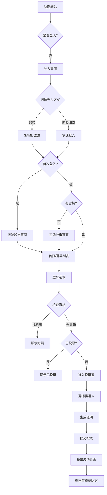
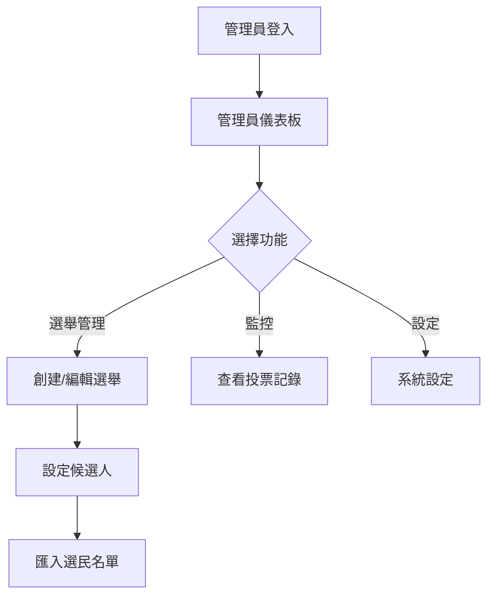

# SAVote UI/UX 設計規範文檔

## 📋 目錄

1. [設計系統](#設計系統)
2. [頁面架構](#頁面架構)
3. [使用者流程](#使用者流程)
4. [頁面詳細規格](#頁面詳細規格)
5. [組件設計](#組件設計)
6. [響應式設計](#響應式設計)
7. [動畫與互動](#動畫與互動)

---

## 🎨 設計系統

### 色彩系統

```css
/* 主色調 - Google Blue */
--primary-50: #e8f0fe;
--primary-100: #d2e3fc;
--primary-200: #aecbfa;
--primary-300: #8ab4f8;
--primary-400: #669df6;
--primary-500: #4285f4;  /* Google Blue - 主色 */
--primary-600: #1a73e8;
--primary-700: #1967d2;
--primary-800: #185abc;
--primary-900: #174ea6;

/* Google 輔助色 */
--google-red: #ea4335;     /* Google Red */
--google-yellow: #fbbc04;  /* Google Yellow */
--google-green: #34a853;   /* Google Green */

/* 中性色 */
--gray-50: #f8f9fa;   /* Google Gray 50 */
--gray-100: #f1f3f4;  /* Google Gray 100 */
--gray-200: #e8eaed;  /* Google Gray 200 */
--gray-300: #dadce0;  /* Google Gray 300 */
--gray-400: #bdc1c6;  /* Google Gray 400 */
--gray-500: #9aa0a6;  /* Google Gray 500 */
--gray-600: #80868b;  /* Google Gray 600 */
--gray-700: #5f6368;  /* Google Gray 700 */
--gray-800: #3c4043;  /* Google Gray 800 */
--gray-900: #202124;  /* Google Gray 900 */

/* 功能色 */
--success: #34a853;    /* Google Green - 成功 */
--warning: #fbbc04;    /* Google Yellow - 警告 */
--error: #ea4335;      /* Google Red - 錯誤 */
--info: #4285f4;       /* Google Blue - 資訊 */

/* 背景色 */
--bg-primary: #ffffff;
--bg-secondary: #f8f9fa;
--bg-tertiary: #f1f3f4;
--bg-dark: #202124;

/* Google 品牌漸層 */
--gradient-google: linear-gradient(135deg, #4285f4 0%, #34a853 25%, #fbbc04 50%, #ea4335 100%);
--gradient-primary: linear-gradient(135deg, #4285f4 0%, #1a73e8 100%);
```

### 字體系統

```css
/* 字體家族 */
--font-sans: 'Inter', 'Noto Sans TC', system-ui, -apple-system, sans-serif;
--font-mono: 'JetBrains Mono', 'Consolas', monospace;

/* 字體大小 */
--text-xs: 0.75rem;     /* 12px */
--text-sm: 0.875rem;    /* 14px */
--text-base: 1rem;      /* 16px */
--text-lg: 1.125rem;    /* 18px */
--text-xl: 1.25rem;     /* 20px */
--text-2xl: 1.5rem;     /* 24px */
--text-3xl: 1.875rem;   /* 30px */
--text-4xl: 2.25rem;    /* 36px */
--text-5xl: 3rem;       /* 48px */

/* 字重 */
--font-normal: 400;
--font-medium: 500;
--font-semibold: 600;
--font-bold: 700;

/* 行高 */
--leading-tight: 1.25;
--leading-normal: 1.5;
--leading-relaxed: 1.75;
```

### 間距系統

```css
--spacing-1: 0.25rem;   /* 4px */
--spacing-2: 0.5rem;    /* 8px */
--spacing-3: 0.75rem;   /* 12px */
--spacing-4: 1rem;      /* 16px */
--spacing-5: 1.25rem;   /* 20px */
--spacing-6: 1.5rem;    /* 24px */
--spacing-8: 2rem;      /* 32px */
--spacing-10: 2.5rem;   /* 40px */
--spacing-12: 3rem;     /* 48px */
--spacing-16: 4rem;     /* 64px */
--spacing-20: 5rem;     /* 80px */
```

### 圓角系統

```css
--radius-sm: 0.25rem;   /* 4px */
--radius-md: 0.5rem;    /* 8px */
--radius-lg: 0.75rem;   /* 12px */
--radius-xl: 1rem;      /* 16px */
--radius-2xl: 1.5rem;   /* 24px */
--radius-full: 9999px;  /* 完全圓角 */
```

### 陰影系統

```css
--shadow-xs: 0 1px 2px 0 rgb(0 0 0 / 0.05);
--shadow-sm: 0 1px 3px 0 rgb(0 0 0 / 0.1), 0 1px 2px -1px rgb(0 0 0 / 0.1);
--shadow-md: 0 4px 6px -1px rgb(0 0 0 / 0.1), 0 2px 4px -2px rgb(0 0 0 / 0.1);
--shadow-lg: 0 10px 15px -3px rgb(0 0 0 / 0.1), 0 4px 6px -4px rgb(0 0 0 / 0.1);
--shadow-xl: 0 20px 25px -5px rgb(0 0 0 / 0.1), 0 8px 10px -6px rgb(0 0 0 / 0.1);
--shadow-2xl: 0 25px 50px -12px rgb(0 0 0 / 0.25);
```

---

## 🏗️ 頁面架構

### 完整頁面清單

#### 公開頁面（未登入可訪問）
1. **登入頁面** (`/auth/login`)
2. **SAML 回調頁面** (`/auth/callback`) - 自動處理
3. **密鑰設定頁面** (`/auth/setup`) - 首次登入後
4. **密鑰恢復頁面** (`/auth/recover`) - 遺失密鑰時
5. **錯誤頁面** (`/auth/error`) - 認證失敗

#### 一般使用者頁面（需登入）
6. **首頁/選舉列表** (`/`)
7. **投票室** (`/vote/:electionId`)
8. **投票成功頁面** (`/vote/:electionId/success`)
9. **驗證中心** (`/verify/:electionId`)
10. **個人設定** (`/settings`)
11. **密鑰管理** (`/settings/keys`)

#### 管理員頁面（需 ADMIN 角色）
12. **管理員儀表板** (`/admin`)
13. **選舉管理** (`/admin/elections`)
14. **選舉創建/編輯** (`/admin/elections/new` 或 `/admin/elections/:id/edit`)
15. **候選人管理** (`/admin/elections/:id/candidates`)
16. **選民資格管理** (`/admin/voters`)
17. **投票記錄監控** (`/admin/logs`)
18. **系統設定** (`/admin/settings`)

---

## 🔄 使用者流程

### 一般使用者流程



### 管理員流程



---

## 📄 頁面詳細規格

### 1. 登入頁面 (`/auth/login`)

#### 設計目標
- 簡潔專業的第一印象
- 清楚的品牌識別
- 明確的行動呼籲

#### 佈局結構

```
┌─────────────────────────────────────┐
│                                     │
│          [Google Colors Logo]       │
│              🔵🔴🟡🟢               │
│                                     │
│      國立彰化師範大學               │
│       學生會投票系統                │
│                                     │
│  ┌───────────────────────────┐    │
│  │                           │    │
│  │    使用學校 Portal 帳號登入    │    │
│  │                           │    │
│  │  ┌─────────────────────┐ │    │
│  │  │ 🎓 使用學校帳號登入   │ │    │
│  │  │      (SAML SSO)      │ │    │
│  │  │         →            │ │    │
│  │  └─────────────────────┘ │    │
│  │                           │    │
│  │  ──── 其他登入方式 ────     │    │
│  │                           │    │
│  │  ┌─────────────────────┐ │    │
│  │  │ 🔑 管理員登入         │ │    │
│  │  │   (Admin Portal)     │ │    │
│  │  └─────────────────────┘ │    │
│  │                           │    │
│  │  ┌─────────────────────┐ │    │
│  │  │ ⚙️ 開發測試登入       │ │    │
│  │  │   (Dev Only)         │ │    │
│  │  └─────────────────────┘ │    │
│  │                           │    │
│  │  管理員與開發測試按鈕         │    │
│  │  僅在對應環境中顯示           │    │
│  │                           │    │
│  └───────────────────────────┘    │
│                                     │
│     需要幫助？ | 隱私權政策          │
│                                     │
└─────────────────────────────────────┘
```

#### 樣式規格

**頁面背景：**
- 基礎：深色漸層 `from-slate-900 via-slate-800 to-slate-900`
- 動畫網格：使用 CSS Grid pattern 或粒子效果
- 光暈效果：多個 blur circle 動畫（藍、綠、紫色）
- 玻璃態效果層：半透明漸層覆蓋

**容器卡片（Glassmorphism）：**
- 最大寬度：440px
- 內距：48px (桌面) / 28px (行動)
- 背景：半透明玻璃態
  - `background: rgba(255, 255, 255, 0.08)`
  - `backdrop-filter: blur(20px) saturate(180%)`
  - `border: 1px solid rgba(255, 255, 255, 0.18)`
- 陰影：`0 8px 32px 0 rgba(31, 38, 135, 0.37)`
- 圓角：`radius-2xl` (24px)
- 動畫：淡入 + 向上滑動 (0.6s ease-out)

**頂部裝飾：**
- Google 品牌四色光條：發光動畫
- 漸層：`linear-gradient(90deg, #4285f4, #ea4335, #fbbc04, #34a853)`
- 高度：3px
- 光暈效果：`box-shadow: 0 0 20px rgba(66, 133, 244, 0.6)`
- 動畫：左右掃描效果 (3s infinite)

**Logo 設計：**
- 容器：玻璃態圓形
  - 尺寸：80px × 80px
  - 背景：`rgba(66, 133, 244, 0.1)`
  - 邊框：`1px solid rgba(66, 133, 244, 0.3)`
  - 內陰影：發光效果
- Google 四色圓點：懸浮動畫
  - 位置：Logo 上方
  - 動畫：上下浮動 (各自不同延遲)
  - 發光：`box-shadow: 0 0 10px currentColor`
- 中文字「投」：
  - 漸層文字：Google Blue gradient
  - 字體：bold, 2xl
  - 動畫：微微旋轉 + 脈動 (hover)

**標題文字：**
- 主標題：漸層文字效果
  - `background: linear-gradient(135deg, #ffffff 0%, #e0e7ff 100%)`
  - `background-clip: text`
  - 字重：bold
  - 陰影：文字發光效果
- 副標題：半透明白色 `rgba(255, 255, 255, 0.7)`

**主按鈕（SAML SSO）：**
- 寬度：100%
- 高度：56px
- 背景：Google Blue 漸層
  - `background: linear-gradient(135deg, #4285f4 0%, #1a73e8 100%)`
  - Hover: 漸層位移動畫
- 文字：白色，font-semibold，text-base
- 圖示：🎓 (左側，動畫搖擺)
- 圓角：radius-xl (12px)
- 陰影：發光 + 深度
  - Normal: `0 4px 15px rgba(66, 133, 244, 0.4)`
  - Hover: `0 6px 25px rgba(66, 133, 244, 0.6)`
- 動畫：
  - Hover: `transform: translateY(-2px) scale(1.02)`
  - Active: `transform: scale(0.98)`
  - 漸層流動效果
- Ripple 效果：點擊時波紋擴散

**管理員按鈕（Glassmorphism）：**
- 寬度：100%
- 高度：52px
- 背景：半透明玻璃
  - `rgba(66, 133, 244, 0.1)`
  - `backdrop-filter: blur(10px)`
- 邊框：2px solid 發光邊框
  - `rgba(66, 133, 244, 0.5)`
  - 光暈：`box-shadow: 0 0 15px rgba(66, 133, 244, 0.3)`
- 文字：漸層藍色
- 圖示：🔑 (左側，旋轉動畫 hover)
- 圓角：radius-xl
- Hover：
  - 背景加深：`rgba(66, 133, 244, 0.2)`
  - 邊框發光增強
  - 向上平移：`translateY(-2px)`

**開發測試按鈕：**
- 寬度：100%
- 高度：48px
- 背景：極淡玻璃態
  - `rgba(255, 255, 255, 0.03)`
- 邊框：1px dashed `rgba(255, 255, 255, 0.2)`
- 文字：`rgba(255, 255, 255, 0.5)`
- 圖示：⚙️ (左側，旋轉動畫)
- 圓角：radius-lg
- Hover：
  - 背景：`rgba(255, 255, 255, 0.08)`
  - 文字：`rgba(255, 255, 255, 0.8)`
  - 齒輪旋轉

**分隔線：**
- 線條：漸層
  - `linear-gradient(90deg, transparent, rgba(255,255,255,0.3), transparent)`
- 文字標籤：玻璃態徽章
  - 背景：`rgba(255, 255, 255, 0.1)`
  - 邊框：`1px solid rgba(255, 255, 255, 0.2)`
  - 圓角：full
  - 內距：px-4 py-1

**動畫效果總覽：**
1. **頁面載入**
   - 背景光暈：緩慢移動 (20s infinite)
   - 卡片：淡入 + 向上滑 (0.6s ease-out)
   - Logo: 彈跳 (0.8s ease-out, delay 0.2s)
   - 按鈕：序列淡入 (stagger 0.1s each)

2. **互動動畫**
   - 按鈕 Hover: 平移 + 發光增強 (0.2s)
   - 按鈕點擊: Ripple 波紋 + 縮放
   - 圖示：旋轉/搖擺 (0.3s)
   - 輸入框 Focus: 邊框發光脈動

3. **背景動畫**
   - 粒子漂浮：緩慢上升 (15s infinite)
   - 光暈呼吸：放大縮小 (4s infinite)
   - 網格掃描：從上到下 (8s infinite)

**響應式調整：**
- Mobile (< 640px):
  - 卡片內距：24px
  - Logo 尺寸：64px
  - 按鈮高度：-4px
  - 文字縮小一級

**響應式斷點：**
- Mobile: < 640px
- Tablet: 640px - 1024px
- Desktop: > 1024px

---

### 2. 首頁/選舉列表 (`/`)

#### 設計目標
- 快速瀏覽所有可用選舉
- 清楚顯示選舉狀態
- 便捷的管理員入口

#### 佈局結構

```
┌──────────────────────────────────────────────────┐
│ [Logo] 國立彰化師範大學 學生會投票系統    [用戶] [登出] │
└──────────────────────────────────────────────────┘

┌──────────────────────────────────────────────────┐
│                                                  │
│  投票列表                                         │
│  查看並參與當前正在進行的選舉活動。                │
│                                                  │
└──────────────────────────────────────────────────┘

┌─────────────────┐  ┌─────────────────┐  ┌──────────────┐
│                 │  │                 │  │              │
│  🗳️ 2025 學生會 │  │  📊 系學會選舉   │  │  🎓 畢聯會    │
│   會長選舉       │  │                 │  │              │
│                 │  │                 │  │              │
│  投票中          │  │  即將開始        │  │  已結束       │
│  剩餘 3 天       │  │  12/15 開始     │  │              │
│                 │  │                 │  │              │
│  ✅ 具投票資格   │  │  ⏰ 尚未開始     │  │  📈 查看結果  │
│                 │  │                 │  │              │
│  [前往投票]      │  │  [設定提醒]      │  │  [查看結果]   │
│  [查看詳情]      │  │                 │  │  [驗證投票]   │
│                 │  │                 │  │              │
└─────────────────┘  └─────────────────┘  └──────────────┘

┌──────────────────────────────────────────────────┐
│  🛡️ 管理員專區                          [Admin] │
│                                                  │
│  ┌──────────────┐  ┌──────────────┐            │
│  │ 👥 選民資格   │  │ 🗳️ 選舉管理   │            │
│  │   管理       │  │               │            │
│  │              │  │               │            │
│  └──────────────┘  └──────────────┘            │
└──────────────────────────────────────────────────┘
```

#### 選舉卡片設計

**狀態指示器：**
- 投票中：綠色圓點 + 脈動動畫
- 即將開始：橙色圓點
- 已結束：灰色圓點

**卡片樣式：**
- 背景：白色
- 邊框：1px gray-200
- 圓角：radius-xl
- 陰影：shadow-md，hover 時 shadow-lg
- 過渡動畫：transform 0.2s ease

**響應式網格：**
- Mobile: 1 列
- Tablet: 2 列
- Desktop: 3 列
- 間距：gap-6

---

### 3. 投票室 (`/vote/:electionId`)

#### 設計目標
- 直觀的候選人選擇介面
- 清楚的操作步驟提示
- 安全感與隱私保障

#### 佈局結構

```
┌──────────────────────────────────────────────────┐
│ ← 返回                    2025 學生會會長選舉      │
└──────────────────────────────────────────────────┘

┌──────────────────────────────────────────────────┐
│                                                  │
│  步驟 1 / 2：選擇候選人                          │
│  ━━━━━━━━━━━━━━━━━━━━━━━━━━━━━━                 │
│                                                  │
└──────────────────────────────────────────────────┘

┌───────────────────┐  ┌───────────────────┐
│                   │  │                   │
│   [候選人照片]     │  │   [候選人照片]     │
│                   │  │                   │
│   1號 王小明       │  │   2號 李小華       │
│   資工系四年級      │  │   企管系三年級      │
│                   │  │                   │
│   📋 政見：        │  │   📋 政見：        │
│   • 改善社團空間   │  │   • 提升校園網路   │
│   • 增加活動經費   │  │   • 優化選課系統   │
│                   │  │                   │
│   [選擇此候選人]   │  │   [選擇此候選人]   │
│                   │  │                   │
└───────────────────┘  └───────────────────┘

┌───────────────────┐
│                   │
│   [候選人照片]     │
│                   │
│   3號 陳小美       │
│   電機系四年級      │
│                   │
│   📋 政見：        │
│   • 爭取學生權益   │
│   • 加強校際交流   │
│                   │
│   ✅ 已選擇        │
│                   │
└───────────────────┘

┌──────────────────────────────────────────────────┐
│                                                  │
│  當前選擇：3號 陳小美                             │
│                                      [下一步 →]   │
│                                                  │
└──────────────────────────────────────────────────┘
```

#### 候選人卡片設計

**未選中狀態：**
- 背景：白色
- 邊框：2px gray-200
- 按鈕：primary-600

**已選中狀態：**
- 背景：primary-50
- 邊框：3px primary-500
- 圖示：✅ 核取記號
- 動畫：選中時放大 scale(1.02)

**照片容器：**
- 寬高比：1:1 (正方形)
- 圓角：radius-lg
- 物件適配：cover
- 預設圖：漸層背景 + 姓名縮寫

---

### 4. 投票確認頁面 (`/vote/:electionId` - Step 2)

#### 佈局結構

```
┌──────────────────────────────────────────────────┐
│ ← 返回                    2025 學生會會長選舉      │
└──────────────────────────────────────────────────┘

┌──────────────────────────────────────────────────┐
│                                                  │
│  步驟 2 / 2：確認投票                            │
│  ━━━━━━━━━━━━━━━━━━━━━━━━━━━━━━━━━━━━         │
│                                                  │
└──────────────────────────────────────────────────┘

┌──────────────────────────────────────────────────┐
│                                                  │
│  📋 投票確認                                     │
│                                                  │
│  您選擇的候選人：                                 │
│                                                  │
│  ┌────────────────────────────────────────┐    │
│  │                                        │    │
│  │   [候選人照片]                         │    │
│  │                                        │    │
│  │   3號 陳小美                           │    │
│  │   電機系四年級                          │    │
│  │                                        │    │
│  └────────────────────────────────────────┘    │
│                                                  │
│  ⚠️ 重要提醒                                     │
│                                                  │
│  • 投票送出後無法修改                             │
│  • 系統採用零知識證明，保證投票匿名性              │
│  • 您可以在投票後驗證自己的投票是否被正確計入       │
│                                                  │
│  ┌──────────────────────────────────────┐      │
│  │ ☐ 我已確認選擇，並了解投票規則        │      │
│  └──────────────────────────────────────┘      │
│                                                  │
│  [← 重新選擇]              [確認送出投票 →]       │
│                                                  │
└──────────────────────────────────────────────────┘
```

#### 生成證明中介面

```
┌──────────────────────────────────────────────────┐
│                                                  │
│              [載入動畫]                          │
│                                                  │
│        正在生成零知識證明...                      │
│                                                  │
│  這可能需要幾秒鐘時間，請勿關閉視窗                │
│                                                  │
│  進度：████████░░░░░░░░░ 60%                    │
│                                                  │
└──────────────────────────────────────────────────┘
```

---

### 5. 投票成功頁面 (`/vote/:electionId/success`)

#### 佈局結構

```
┌──────────────────────────────────────────────────┐
│                                                  │
│              ✅                                  │
│                                                  │
│          投票成功！                               │
│                                                  │
│  您的投票已成功送出並記錄在區塊鏈上                │
│                                                  │
│  ┌────────────────────────────────────────┐    │
│  │  投票收據                               │    │
│  │                                        │    │
│  │  選舉：2025 學生會會長選舉              │    │
│  │  時間：2025-12-01 16:30:45             │    │
│  │  交易 ID：0x7a3f2b...8d4c              │    │
│  │                                        │    │
│  │  [下載收據] [複製 ID]                   │    │
│  └────────────────────────────────────────┘    │
│                                                  │
│  💡 您可以使用交易 ID 來驗證您的投票               │
│                                                  │
│  [前往驗證中心]              [返回首頁]           │
│                                                  │
└──────────────────────────────────────────────────┘
```

#### 動畫效果
- 成功圖示：放大淡入 + 彈跳效果
- 收據卡片：從下方滑入
- 按鈕：淡入延遲動畫

---

### 6. 驗證中心 (`/verify/:electionId`)

#### 設計目標
- 透明的投票記錄查詢
- 簡單的驗證操作
- 清楚的統計展示

#### 佈局結構

```
┌──────────────────────────────────────────────────┐
│ ← 返回                    驗證中心                │
└──────────────────────────────────────────────────┘

┌──────────────────────────────────────────────────┐
│                                                  │
│  🔍 驗證您的投票                                 │
│                                                  │
│  輸入您的投票交易 ID 來驗證投票是否被正確記錄       │
│                                                  │
│  ┌────────────────────────────────────────┐    │
│  │  [輸入框] 0x7a3f2b...                   │ 🔍 │
│  └────────────────────────────────────────┘    │
│                                                  │
│  或上傳您的投票收據                               │
│  [上傳檔案]                                      │
│                                                  │
└──────────────────────────────────────────────────┘

┌──────────────────────────────────────────────────┐
│                                                  │
│  📊 即時開票結果                                 │
│                                                  │
│  總投票數：1,234 票                              │
│                                                  │
│  ━━━━━━━━━━━━━━━━━━━━━━                        │
│                                                  │
│  1號 王小明                           [進度條]   │
│  456 票 (37.0%)                                 │
│                                                  │
│  2號 李小華                           [進度條]   │
│  389 票 (31.5%)                                 │
│                                                  │
│  3號 陳小美                           [進度條]   │
│  389 票 (31.5%)                                 │
│                                                  │
│  最後更新：2025-12-01 16:35:20                   │
│  [🔄 重新整理]                                   │
│                                                  │
└──────────────────────────────────────────────────┘
```

#### 驗證結果展示

```
┌──────────────────────────────────────────────────┐
│                                                  │
│  ✅ 驗證成功                                     │
│                                                  │
│  您的投票已被正確記錄在系統中                      │
│                                                  │
│  交易詳情：                                      │
│  • 選舉：2025 學生會會長選舉                      │
│  • 時間：2025-12-01 16:30:45                    │
│  • 區塊高度：#123456                             │
│  • Merkle 證明：已驗證 ✓                         │
│                                                  │
│  [關閉]                                          │
│                                                  │
└──────────────────────────────────────────────────┘
```

---

### 7. 密鑰設定頁面 (`/auth/setup`)

#### 佈局結構

```
┌──────────────────────────────────────────────────┐
│                                                  │
│  🔐 設定您的匿名投票密鑰                         │
│                                                  │
│  為了保護您的投票隱私，系統將為您生成一個專屬密鑰   │
│  請務必妥善保管，遺失後將無法證明投票身份           │
│                                                  │
└──────────────────────────────────────────────────┘

┌──────────────────────────────────────────────────┐
│                                                  │
│  [生成密鑰動畫]                                  │
│                                                  │
│  正在生成您的專屬密鑰...                          │
│                                                  │
└──────────────────────────────────────────────────┘

↓ (生成完成後)

┌──────────────────────────────────────────────────┐
│                                                  │
│  ✅ 密鑰已生成                                   │
│                                                  │
│  ┌────────────────────────────────────────┐    │
│  │  您的匿名密鑰                           │    │
│  │                                        │    │
│  │  ●●●●●●●●●●●●●●●●●●●●●●●●●●●●●●       │ 👁️  │
│  │  ●●●●●●●●●●●●●●●●●●●●●●●●●●●●●●       │    │
│  │                                        │    │
│  │  [📋 複製]  [💾 下載備份]               │    │
│  └────────────────────────────────────────┘    │
│                                                  │
│  ⚠️ 重要提醒                                     │
│                                                  │
│  • 請立即下載並保存密鑰備份檔案                    │
│  • 密鑰遺失後無法找回                             │
│  • 切勿將密鑰分享給他人                           │
│  • 建議使用密碼管理器或安全的雲端儲存              │
│                                                  │
│  ☐ 我已安全保存密鑰備份                          │
│                                                  │
│  [完成設定]                                      │
│                                                  │
└──────────────────────────────────────────────────┘
```

---

### 8. 管理員儀表板 (`/admin`)

#### 佈局結構

```
┌──────────────────────────────────────────────────┐
│ [Logo] 管理後台                    [管理員] [登出] │
│                                                  │
│ [儀表板] [選舉管理] [選民管理] [記錄] [設定]       │
└──────────────────────────────────────────────────┘

┌──────────────────────────────────────────────────┐
│                                                  │
│  管理員儀表板                                     │
│  系統概覽與快速操作                               │
│                                                  │
└──────────────────────────────────────────────────┘

┌─────────────┐ ┌─────────────┐ ┌─────────────┐
│ 📊 總投票數  │ │ 🗳️ 進行中   │ │ 👥 註冊人數 │
│             │ │             │ │             │
│   1,234     │ │     3       │ │   5,678     │
│             │ │             │ │             │
└─────────────┘ └─────────────┘ └─────────────┘

┌──────────────────────────────────────────────────┐
│                                                  │
│  📈 投票趨勢圖                                   │
│                                                  │
│  [折線圖：顯示過去 7 天的投票數量變化]             │
│                                                  │
└──────────────────────────────────────────────────┘

┌──────────────────────────────────────────────────┐
│                                                  │
│  🗳️ 最近的選舉                                   │
│                                                  │
│  ┌────────────────────────────────────────┐    │
│  │ 2025 學生會會長選舉      [進行中]       │    │
│  │ 投票數：234  |  開始：2025-11-28       │    │
│  │ [查看詳情] [管理候選人] [下載報告]      │    │
│  └────────────────────────────────────────┘    │
│                                                  │
│  ┌────────────────────────────────────────┐    │
│  │ 系學會會長選舉          [即將開始]       │    │
│  │ 開始時間：2025-12-15 09:00             │    │
│  │ [編輯設定] [匯入選民]                   │    │
│  └────────────────────────────────────────┘    │
│                                                  │
└──────────────────────────────────────────────────┘
```

---

### 9. 選舉管理頁面 (`/admin/elections`)

#### 佈局結構

```
┌──────────────────────────────────────────────────┐
│ ← 返回儀表板                選舉管理               │
└──────────────────────────────────────────────────┘

┌──────────────────────────────────────────────────┐
│  所有選舉                          [+ 創建新選舉]  │
└──────────────────────────────────────────────────┘

┌──────────────────────────────────────────────────┐
│ [搜尋] 🔍                    [篩選] ▼  [排序] ▼   │
└──────────────────────────────────────────────────┘

╔══════════════════════════════════════════════════╗
║ 選舉名稱          狀態      投票數    操作        ║
╠══════════════════════════════════════════════════╣
║ 2025學生會會長    進行中    234      [編輯]      ║
║ 2025-11-28 ~     🟢                  [候選人]    ║
║ 2025-12-05                           [選民]      ║
║                                      [刪除]      ║
╠══════════════════════════════════════════════════╣
║ 系學會會長選舉    即將開始  0        [編輯]      ║
║ 2025-12-15 ~     🟡                  [候選人]    ║
║ 2025-12-20                           [選民]      ║
║                                      [刪除]      ║
╠══════════════════════════════════════════════════╣
║ 畢聯會選舉        已結束    567      [查看]      ║
║ 2025-10-01 ~     ⚫                  [報告]      ║
║ 2025-10-07                           [封存]      ║
╚══════════════════════════════════════════════════╝

               [上一頁]  1 2 3  [下一頁]
```

---

### 10. 創建/編輯選舉 (`/admin/elections/new`)

#### 佈局結構

```
┌──────────────────────────────────────────────────┐
│ ← 返回                    創建新選舉               │
└──────────────────────────────────────────────────┘

┌──────────────────────────────────────────────────┐
│                                                  │
│  基本資訊                                         │
│                                                  │
│  選舉名稱 *                                       │
│  ┌────────────────────────────────────────┐    │
│  │ 2025 學生會會長選舉                     │    │
│  └────────────────────────────────────────┘    │
│                                                  │
│  選舉說明                                         │
│  ┌────────────────────────────────────────┐    │
│  │ [多行文字輸入]                          │    │
│  │                                        │    │
│  └────────────────────────────────────────┘    │
│                                                  │
│  投票時間 *                                       │
│  ┌──────────────┐      ┌──────────────┐        │
│  │ 開始時間     │      │ 結束時間     │        │
│  │ 📅 2025-12-01│      │ 📅 2025-12-07│        │
│  │ 🕐 09:00     │      │ 🕐 23:59     │        │
│  └──────────────┘      └──────────────┘        │
│                                                  │
└──────────────────────────────────────────────────┘

┌──────────────────────────────────────────────────┐
│                                                  │
│  投票設定                                         │
│                                                  │
│  ☐ 允許棄權票                                    │
│  ☐ 顯示即時開票結果                               │
│  ☐ 投票後立即顯示結果                             │
│                                                  │
│  最多選擇候選人數                                 │
│  ┌────┐                                         │
│  │ 1  │ 位                                      │
│  └────┘                                         │
│                                                  │
└──────────────────────────────────────────────────┘

┌──────────────────────────────────────────────────┐
│  [取消]                           [儲存草稿]      │
│                                   [創建選舉]      │
└──────────────────────────────────────────────────┘
```

---

### 11. 候選人管理 (`/admin/elections/:id/candidates`)

#### 佈局結構

```
┌──────────────────────────────────────────────────┐
│ ← 返回            2025 學生會會長選舉 - 候選人管理 │
└──────────────────────────────────────────────────┘

┌──────────────────────────────────────────────────┐
│  候選人列表                        [+ 新增候選人]  │
└──────────────────────────────────────────────────┘

┌───────────────────┐  ┌───────────────────┐
│                   │  │                   │
│   [候選人照片]     │  │   [候選人照片]     │
│                   │  │                   │
│   1號 王小明       │  │   2號 李小華       │
│   資工系四年級      │  │   企管系三年級      │
│                   │  │                   │
│   📋 政見：        │  │   📋 政見：        │
│   改善社團空間...   │  │   提升校園網路...   │
│                   │  │                   │
│   [✏️ 編輯]        │  │   [✏️ 編輯]        │
│   [🗑️ 刪除]        │  │   [🗑️ 刪除]        │
│                   │  │                   │
└───────────────────┘  └───────────────────┘

┌───────────────────┐
│                   │
│   [上傳照片區域]   │
│                   │
│   [+ 新增候選人]   │
│                   │
└───────────────────┘
```

#### 新增/編輯候選人彈窗

```
┌──────────────────────────────────────────────────┐
│  新增候選人                               [✕ 關閉] │
├──────────────────────────────────────────────────┤
│                                                  │
│  候選人編號 *                                     │
│  ┌────┐                                         │
│  │ 3  │ 號                                      │
│  └────┘                                         │
│                                                  │
│  候選人姓名 *                                     │
│  ┌────────────────────────────────────────┐    │
│  │ 陳小美                                  │    │
│  └────────────────────────────────────────┘    │
│                                                  │
│  系級 *                                          │
│  ┌────────────────────────────────────────┐    │
│  │ 電機系四年級                            │    │
│  └────────────────────────────────────────┘    │
│                                                  │
│  候選人照片                                       │
│  ┌────────────────────────────────────────┐    │
│  │                                        │    │
│  │     [拖曳或點擊上傳照片]                │    │
│  │     支援 JPG, PNG (最大 5MB)           │    │
│  │                                        │    │
│  └────────────────────────────────────────┘    │
│                                                  │
│  政見 *                                          │
│  ┌────────────────────────────────────────┐    │
│  │ [多行文字輸入]                          │    │
│  │                                        │    │
│  │                                        │    │
│  └────────────────────────────────────────┘    │
│                                                  │
│  [取消]                           [確認新增]      │
│                                                  │
└──────────────────────────────────────────────────┘
```

---

### 12. 選民資格管理 (`/admin/voters`)

#### 佈局結構

```
┌──────────────────────────────────────────────────┐
│ ← 返回儀表板                選民資格管理            │
└──────────────────────────────────────────────────┘

┌──────────────────────────────────────────────────┐
│  匯入選民名單                                     │
│                                                  │
│  選擇選舉 *                                       │
│  ┌────────────────────────────────────────┐    │
│  │ [下拉選單] 2025 學生會會長選舉          ▼ │    │
│  └────────────────────────────────────────┘    │
│                                                  │
│  上傳 CSV 檔案 *                                 │
│  ┌────────────────────────────────────────┐    │
│  │                                        │    │
│  │  📄 拖曳檔案至此處或點擊上傳             │    │
│  │                                        │    │
│  │  CSV 格式要求：                         │    │
│  │  • 第一行：studentId, class, email     │    │
│  │  • 學號使用 SHA-256 雜湊值              │    │
│  │                                        │    │
│  └────────────────────────────────────────┘    │
│                                                  │
│  [下載 CSV 範本]                                 │
│                                                  │
│  [匯入]                                          │
│                                                  │
└──────────────────────────────────────────────────┘

┌──────────────────────────────────────────────────┐
│  匯入結果                                         │
│                                                  │
│  ✅ 成功匯入 1,234 筆資料                        │
│  ⚠️ 跳過 5 筆重複資料                            │
│  ❌ 2 筆資料格式錯誤                             │
│                                                  │
│  [查看錯誤詳情]  [下載錯誤報告]                   │
│                                                  │
└──────────────────────────────────────────────────┘
```

---

## 🧩 組件設計

### 按鈕組件

```typescript
// Button 變體
type ButtonVariant = 'primary' | 'secondary' | 'outline' | 'ghost' | 'danger';
type ButtonSize = 'sm' | 'md' | 'lg';

// 主按鈕 (Primary)
背景：primary-600 → primary-700 (hover)
文字：白色
陰影：shadow-sm → shadow-md (hover)
圓角：radius-lg
動畫：transform + shadow transition

// 次要按鈕 (Secondary)
背景：gray-100 → gray-200 (hover)
文字：gray-900
邊框：無

// 外框按鈕 (Outline)
背景：透明 → gray-50 (hover)
文字：primary-600
邊框：2px primary-600

// 幽靈按鈕 (Ghost)
背景：透明 → gray-100 (hover)
文字：gray-700
邊框：無

// 危險按鈕 (Danger)
背景：error → 加深 (hover)
文字：白色
```

### 卡片組件

```typescript
// Card 變體
type CardVariant = 'default' | 'elevated' | 'bordered' | 'interactive';

// 預設卡片
背景：白色
邊框：1px gray-200
圓角：radius-xl
內距：padding-6

// 懸浮卡片
陰影：shadow-lg
邊框：無

// 互動式卡片
Hover：transform translateY(-2px)
Hover：shadow-lg
Cursor：pointer
過渡：all 0.2s ease
```

### 輸入框組件

```typescript
// Input 狀態
type InputState = 'default' | 'focus' | 'error' | 'disabled';

// 預設狀態
背景：白色
邊框：1px gray-300
圓角：radius-md
高度：44px
內距：px-4 py-2

// Focus 狀態
邊框：2px primary-500
陰影：0 0 0 3px primary-100
outline：none

// Error 狀態
邊框：2px error
陰影：0 0 0 3px error/10

// Disabled 狀態
背景：gray-100
文字：gray-400
Cursor：not-allowed
```

### 狀態標籤組件

```typescript
// Badge 變體
type BadgeVariant = 'success' | 'warning' | 'error' | 'info' | 'neutral';

// 成功標籤
背景：success/10
文字：success
圓點：success (脈動動畫)

// 警告標籤
背景：warning/10
文字：warning

// 錯誤標籤
背景：error/10
文字：error

// 資訊標籤
背景：info/10
文字：info
```

### 模態視窗組件

```typescript
// Modal 結構
背景遮罩：rgba(0, 0, 0, 0.5) + backdrop-blur
內容卡片：白色, shadow-2xl, radius-2xl
最大寬度：600px
動畫：淡入 + 縮放

// 關閉行為
- 點擊遮罩
- ESC 鍵
- 右上角 X 按鈕
```

### 載入動畫組件

```typescript
// Spinner
尺寸：sm(16px), md(24px), lg(32px)
顏色：primary-600
動畫：旋轉 0.8s linear infinite

// Skeleton
背景：linear-gradient shimmer 效果
高度：根據內容類型調整
圓角：與對應元素相同
```

---

## 📱 響應式設計

### 斷點定義

```css
/* Mobile First */
@media (min-width: 640px)  { /* sm - 平板直向 */ }
@media (min-width: 768px)  { /* md - 平板橫向 */ }
@media (min-width: 1024px) { /* lg - 筆電 */ }
@media (min-width: 1280px) { /* xl - 桌機 */ }
@media (min-width: 1536px) { /* 2xl - 大螢幕 */ }
```

### 響應式佈局策略

#### 導航列
- **Mobile (< 640px)**
  - 漢堡選單
  - Logo 縮小
  - 使用者資訊隱藏

- **Tablet (640px - 1024px)**
  - 展開導航
  - 顯示主要功能
  - 次要功能收合

- **Desktop (> 1024px)**
  - 完整導航列
  - 所有功能可見
  - 搜尋欄展開

#### 選舉卡片網格
- **Mobile**: 1 欄
- **Tablet**: 2 欄
- **Desktop**: 3 欄

#### 候選人卡片
- **Mobile**: 1 欄，縱向排列
- **Tablet**: 2 欄
- **Desktop**: 3 欄，橫向排列

#### 表格
- **Mobile**: 卡片式展示
- **Tablet**: 簡化表格
- **Desktop**: 完整表格

---

## ✨ 動畫與互動

### 頁面過渡動畫

```typescript
// 淡入淡出
opacity: 0 → 1
duration: 200ms
easing: ease-out

// 滑入滑出
transform: translateY(20px) → translateY(0)
opacity: 0 → 1
duration: 300ms
easing: cubic-bezier(0.4, 0, 0.2, 1)

// 縮放
transform: scale(0.95) → scale(1)
opacity: 0 → 1
duration: 200ms
```

### 互動反饋

```typescript
// 按鈕點擊
Active: transform: scale(0.98)
Ripple: 波紋效果從點擊位置擴散

// 卡片 Hover
transform: translateY(-4px)
shadow: shadow-md → shadow-lg
duration: 200ms

// 輸入框 Focus
border: 2px primary-500
shadow: 0 0 0 3px primary-100
duration: 150ms

// 載入狀態
Skeleton: shimmer 動畫 1.5s infinite
Spinner: rotate 0.8s linear infinite
```

### 微互動

```typescript
// 成功訊息
✅ 圖示放大彈跳
背景從透明到綠色漸層
持續 400ms

// 錯誤訊息
❌ 圖示搖晃動畫
邊框閃爍紅色
持續 300ms

// 數字計數
從 0 計數到目標值
duration: 1s
easing: ease-out

// 進度條
寬度從 0% 到目標%
duration: 根據進度調整
加入脈動效果
```

---

## 🎯 無障礙設計

### ARIA 標籤

```html
<!-- 按鈕 -->
<button aria-label="關閉對話框" aria-pressed="false">

<!-- 表單 -->
<input aria-required="true" aria-invalid="false" aria-describedby="error-msg">

<!-- 狀態 -->
<div role="status" aria-live="polite" aria-atomic="true">

<!-- 導航 -->
<nav aria-label="主要導航">
```

### 鍵盤導航

```typescript
// Tab 順序
tabindex: 0 (正常順序)
tabindex: -1 (程式控制)

// 快捷鍵
Alt + H: 返回首頁
Alt + V: 前往投票
Alt + M: 開啟選單
ESC: 關閉模態視窗

// Focus 樣式
outline: 2px solid primary-500
outline-offset: 2px
```

### 色彩對比

```
文字對比度:
- 正常文字: 至少 4.5:1
- 大文字: 至少 3:1
- 圖示: 至少 3:1

色盲友善:
- 不只依賴顏色傳達資訊
- 使用圖示 + 文字標籤
- 提供高對比模式
```

---

## 📦 實作優先順序

### Phase 1: 核心頁面重構 (Week 1)
1. ✅ 設計系統建立
2. ✅ 登入頁面重新設計
3. ✅ 首頁/選舉列表
4. ✅ 投票室介面

### Phase 2: 使用者體驗優化 (Week 2)
5. ✅ 密鑰設定頁面
6. ✅ 投票確認與成功頁面
7. ✅ 驗證中心
8. ✅ 個人設定頁面

### Phase 3: 管理後台 (Week 3)
9. ✅ 管理員儀表板
10. ✅ 選舉管理頁面
11. ✅ 候選人管理
12. ✅ 選民資格管理

### Phase 4: 優化與測試 (Week 4)
13. ✅ 響應式設計調整
14. ✅ 動畫效果完善
15. ✅ 無障礙功能測試
16. ✅ 效能優化

---

## 🔧 技術實作建議

### 建議使用的套件

```json
{
  "dependencies": {
    "@headlessui/react": "^2.2.0",      // 無障礙組件
    "framer-motion": "^11.0.0",         // 動畫
    "react-hook-form": "^7.53.0",       // 表單處理
    "zod": "^3.23.0",                   // 表單驗證
    "recharts": "^2.12.0",              // 圖表 (儀表板)
    "react-dropzone": "^14.2.0",        // 檔案上傳
    "date-fns": "^3.6.0",               // 日期處理
    "clsx": "^2.1.0",                   // 類名合併
    "tailwind-merge": "^2.5.0"          // Tailwind 類名合併
  }
}
```

### 資料夾結構建議

```
apps/web/src/
├── components/
│   ├── ui/              # 基礎 UI 組件
│   │   ├── Button.tsx
│   │   ├── Card.tsx
│   │   ├── Input.tsx
│   │   ├── Badge.tsx
│   │   ├── Modal.tsx
│   │   └── Spinner.tsx
│   ├── layout/          # 佈局組件
│   │   ├── Header.tsx
│   │   ├── Footer.tsx
│   │   ├── Sidebar.tsx
│   │   └── Container.tsx
│   └── shared/          # 共用組件
│       ├── ElectionCard.tsx
│       ├── CandidateCard.tsx
│       └── StatusBadge.tsx
├── features/
│   ├── auth/
│   │   ├── components/
│   │   ├── pages/
│   │   └── hooks/
│   ├── voting/
│   ├── admin/
│   └── verify/
└── styles/
    ├── globals.css      # 全域樣式
    └── design-tokens.css # 設計系統 token
```

---

## 📝 下一步行動

1. **審核此文檔** - 根據需求調整設計規格
2. **建立設計系統** - 實作 CSS 變數和 Tailwind 配置
3. **創建基礎組件** - Button, Card, Input 等
4. **重構現有頁面** - 依照優先順序逐步改版
5. **測試與優化** - 確保響應式和無障礙功能

---

## 🎨 Glassmorphism 設計實作紀錄

### 已完成項目 (2025-12-01)

#### 1. 動畫系統建立
**檔案**: `apps/web/src/styles/animations.css`
- ✅ 頁面載入動畫 (`fadeInUp`, `bounceIn`)
- ✅ Google 四色圓點浮動效果 (`float` + stagger delays)
- ✅ 光條掃描動畫 (`scanLine` with Google colors)
- ✅ 背景光暈呼吸 (`breathe` with scale + opacity)
- ✅ 粒子上升動畫 (`particleRise`)
- ✅ 按鈕水波紋效果 (`ripple`)
- ✅ Icon 動畫 (`rotate`, `wiggle`)
- ✅ Focus 光環脈動 (`focusPulse`)
- ✅ Skeleton 流光效果 (`shimmer`)
- ✅ 成功動畫 (`successPop`)
- ✅ 載入動畫 (`spin`)
- ✅ 背景網格移動 (`gridMove`)

#### 2. Glassmorphism 工具類
- ✅ `.glass` - 標準玻璃效果 (blur 20px, rgba 0.08)
- ✅ `.glass-strong` - 增強玻璃效果 (blur 30px, rgba 0.12)
- ✅ `.glass-subtle` - 微妙玻璃效果 (blur 10px, rgba 0.03)
- ✅ `.glow-blue-border` - 藍色發光邊框
- ✅ `.glow-blue-strong` - 強藍光效果
- ✅ `.glow-green-border` - 綠色發光邊框

#### 3. 背景動畫組件
**檔案**: `apps/web/src/components/AnimatedBackground.tsx`
- ✅ Canvas 粒子系統
- ✅ 50 個浮動粒子
- ✅ Google 四色隨機分配 (Blue, Red, Yellow, Green)
- ✅ 上升動畫 + 水平飄移
- ✅ 響應式 canvas 尺寸

**檔案**: `apps/web/src/components/GlowOrbs.tsx`
- ✅ 4 個發光球體
- ✅ 呼吸動畫 (scale + opacity)
- ✅ Stagger delays (0s, 2s, 4s, 6s)
- ✅ 100px blur 效果

#### 4. 登入頁面改版
**檔案**: `apps/web/src/features/auth/pages/LoginPage.tsx`
- ✅ 深色漸層背景 (`from-slate-900 via-slate-800 to-slate-900`)
- ✅ 整合 AnimatedBackground 粒子系統
- ✅ 整合 GlowOrbs 光暈效果
- ✅ 網格背景 (`grid-background` class)
- ✅ Glassmorphism 卡片 (`glass` class, rounded-3xl)
- ✅ Google 彩虹掃描線 (`scan-line` class)
- ✅ Logo 彈入動畫 (`bounceIn 1s cubic-bezier`)
- ✅ 四色圓點浮動 (`dot-float-1/2/3/4`)
- ✅ 序列淡入效果 (`stagger-fade-in` on container)
- ✅ 按鈕水波紋互動 (click ripple effect)
- ✅ Icon 動畫 (`icon-wiggle`, `icon-rotate`)
- ✅ 管理員按鈕藍光效果 (`glow-blue-border` → `glow-blue-strong`)

**檔案**: `apps/web/src/features/auth/components/LoginButton.tsx`
- ✅ 水波紋點擊效果 (state 管理 ripples)
- ✅ 藍色漸層 + 發光效果
- ✅ Hover scale 動畫 (1.05x)
- ✅ Icon 放大效果 (group-hover:scale-110)

#### 5. 全域樣式整合
**檔案**: `apps/web/src/index.css`
- ✅ 引入 animations.css (`@import "./styles/animations.css"`)

### 技術亮點

1. **Glassmorphism 實作**
   - `backdrop-filter: blur(20px) saturate(180%)`
   - 半透明背景 `rgba(255,255,255,0.08)`
   - 微妙白色邊框 `rgba(255,255,255,0.18)`

2. **動畫性能優化**
   - 使用 CSS animations (GPU 加速)
   - Canvas 粒子系統 (requestAnimationFrame)
   - 動畫 stagger delays 避免同時觸發

3. **互動設計**
   - 按鈕點擊水波紋 (React state + setTimeout cleanup)
   - Icon hover 動畫 (CSS transform)
   - Focus 狀態光環脈動

4. **深色模式設計**
   - 深色漸層背景 (Slate 900/800)
   - 白色文字 + 藍色強調色
   - 發光效果提升視覺層次

### 待完成項目

- ⏳ 其他頁面 Glassmorphism 改版 (HomePage, VotingBooth, Admin)
- ⏳ Loading 狀態動畫整合
- ⏳ Toast 通知動畫
- ⏳ 頁面切換過渡效果
- ⏳ 響應式動畫調整 (減少移動端動畫複雜度)

---

**文檔版本**: 2.0.0  
**最後更新**: 2025-12-01 (Glassmorphism 完整實作)  
**維護者**: SAVote 開發團隊
